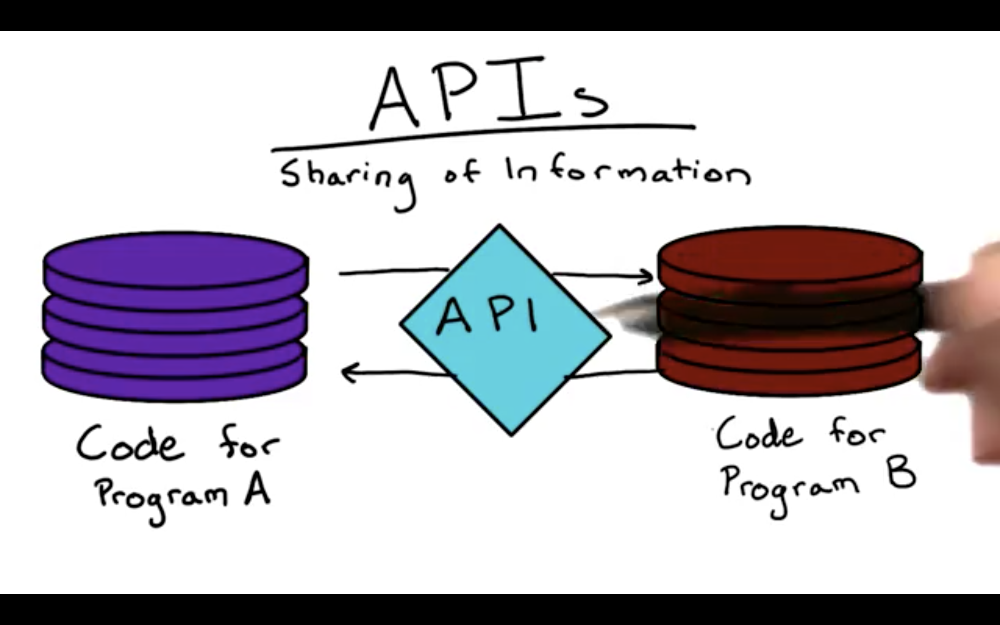

# What are APIs?

The acronym **API** gets thrown around a lot in the computer science community, but what is an API and why is it so important?

Well, APIs are **Aplication Programming Interfaces** referred to **any method of communication between two entities of code.**

You can thing of APIs as connection points in code that allow one application to talk to another.

##### Example 1
When you copy code from a browser and paste it into a word processing application, an API inside your computer helped make that transfer of data happen.

##### Example 2
If you listen to music on your computer, like with iTunes or Spotify, the music-playing application communicated with your operating system's API in order to send that music to your speakers.

APIs are a great way for controlling the exposure of code, allowing internal functionalities of an application to be used from the outside world without exposing all of the internal code.

Companies that want to keep their code bases private, like the makers of Microsoft Windows or Mac OS X, use APIs to make it possible for their applications to still have interactions with other applications without having to reveal the actual code.

Even for open source code projects, like the Ubuntu operating system, APIs make easy entry points to code that other developers will most frequently use. 
