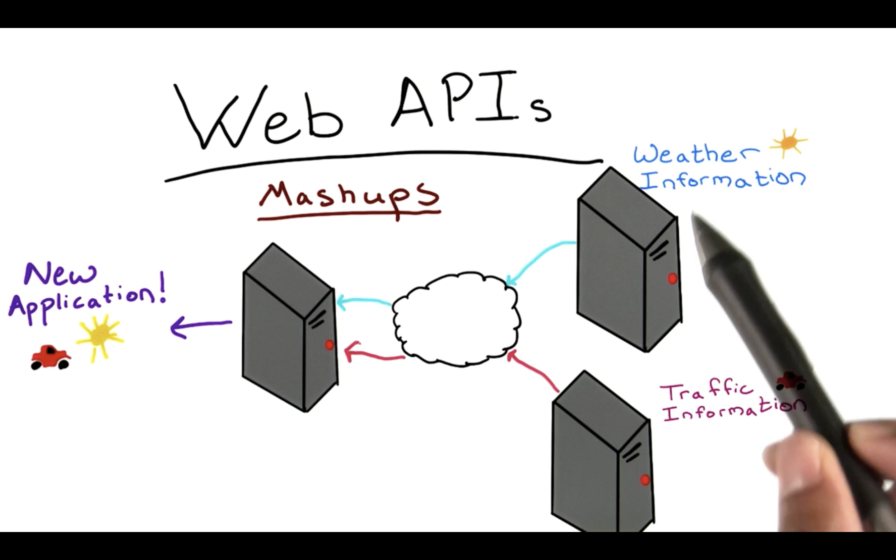

# Web APIs

So you've seen some examples of how APIs can work within the same machine, but what this course is really going to focus on is how APIs can enable communication between several machines. This is where Web APIs come into the picture!

Simply put, Web APIs make it possible to invoke the execution of code on another machine via the Internet.

A machine can use multiple web APIs to create a new application, sometimes called a **Mashup**, providing users with a new experience that leverages existing applications. Soon, you'll be making a Mashup of your own.

##### But why is all this important? And what do companies gain by allowing their content to be accessible via APIs?

By opening up code over the Internet, API providers are not only helping other developers who want to use their code, but are also promoting their own business.

APIs for social media applications, for example, allow users to share content, logins, and personalized data between web applications, gaining popularity, and giving users more functionality with their accounts. This means more traffic, and more users for social media applications with publicly available APIs.

So, implementing accessible web APIs isn't only just a nice thing to do, it's also a lucrative investment for many companies, and in some cases a company's proprietary money stream.

An example of a company that depends heavily on it's API is Twilio: a cloud communications company that allows developers to make and receive phone calls and text messages using its web service API.

Twilio has free and paid access versions of their API, forming a key revenue stream for the company. **[Checkout Twilio's developer's site](https://www.twilio.com/api)** and see all the features of their API.
