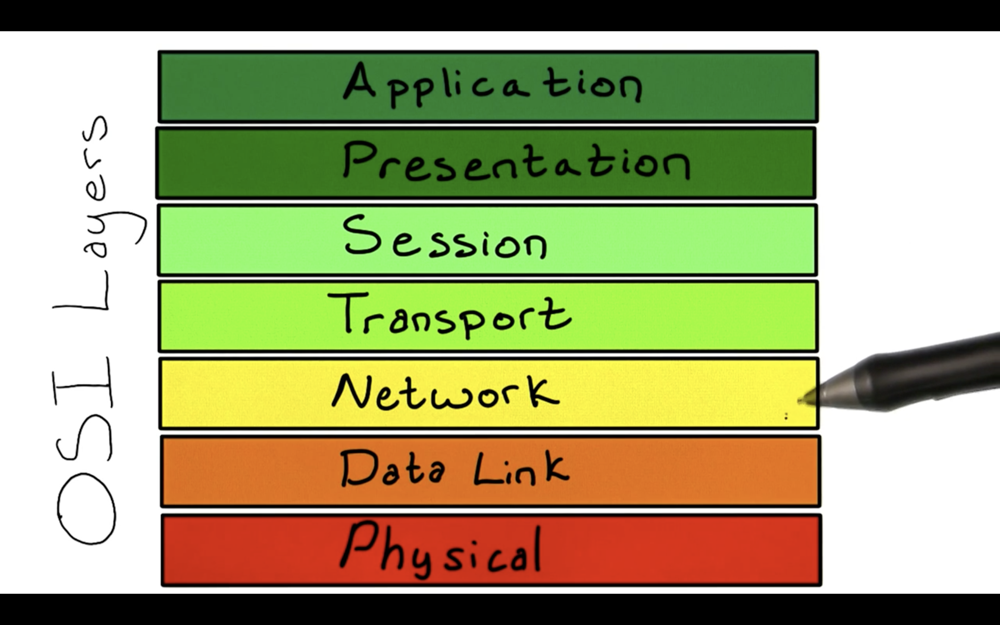

# Web API Protocols

Billions of machines connected to form the World Wide Web, all run using different operating systems, specifications, and data structures. So how do we make sure these devices can all communicate with each other? A set of rules must be in place in order for machines to speak the same language. We call these sets of rules **Protocols**.

A common abstraction for conceptualizing this is with the **Open Systems Interconnection**, or **OSI** model:

This model characterizes the communication fuctions of the computing system, without getting too caught up with the specifics of each different type of computer. This allows the model to focus on the interoperability of diverse communication systems with standard protocols.

The model partitions a communications system into abstraction layers. The original version of the model defines seven layers, as shown in the image above. A layer serves the layer above it, and is served by the layer below it.

A variety of protocols can exist within each layer, but they all have to be able to receive and hand off data to the protocols in the adjacent layers.

#### A good analogy to conceptualize this is...
... like sending a message inside of multiple envelopes. The **Application** layer is the code that makes the original message. It is then passed on to the layer beneath, which wraps this message inside an envelope. Each layer adds another envelope with more information about preparing the message, breaking it up into small packets, routing the message to its intended final destination, and rebuilding the message once it arrives. Once the message reaches the **Physical** layer, it is transmitted as a stream of bits over a **physical media**. **Physical media** are the wires, fiber optic cables or wireless signals that you use to connect to the Internet. Once the message reaches its intended machine, it is now processed in reverse order such that the application sitting on the receiving computer gets the message the same way it was created by the sender.

When it comes to the developing web applications and API design, developers mainly focus on the **Application** layer in the OSI model. Operating systems can handle the complexities of the lower levels for us in most cases. But if you're interested in learning more about the lower layers of networking, please check out **[this link](https://en.wikipedia.org/wiki/OSI_model)**.
