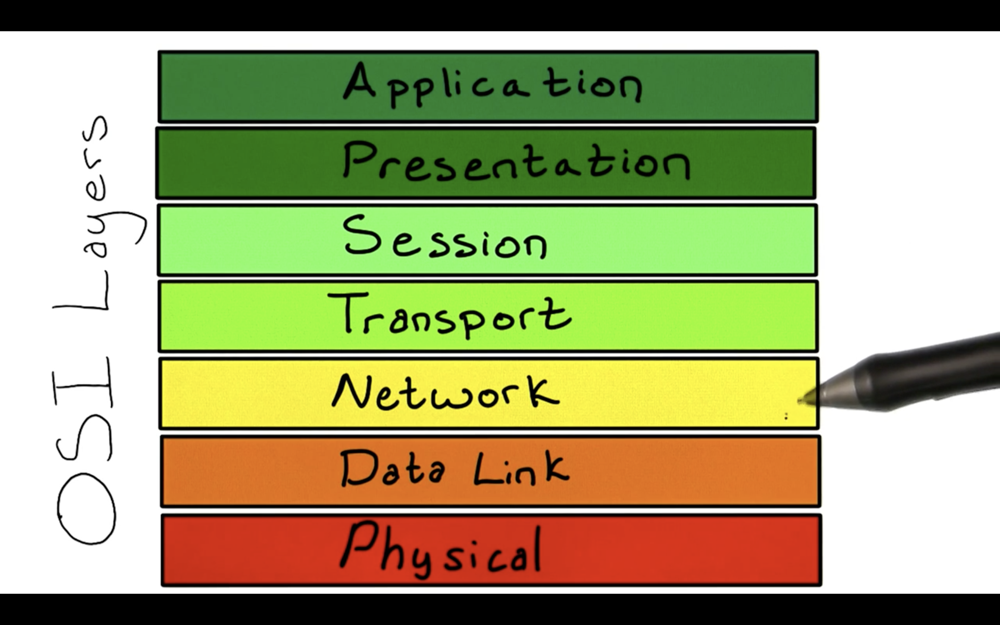
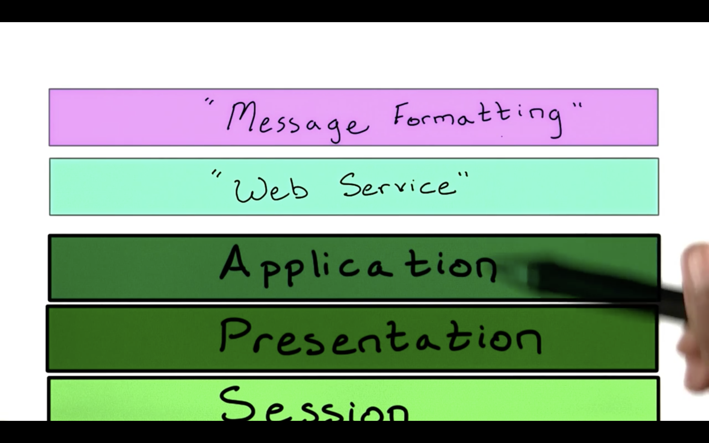

# Digging into the Application Layer

Alright, we've learned that virtually every device that communicates across the internet has a physical layer and these intermediate communication protocol layers that sit on top of it in order to enable the transmission of packets and data streams.

Sitting on top of these layers is the **Application** layer. This layer is responsible for setting all of the protocols in which applications exchange data. The most popular application level protocol is the Hypertext Transfer Protocol, or **HTTP**. HTTP functions via a series of requests and responses between clients and servers respectively. You may be familiar with other acronyms like **FTP**, **IMAP**, **SSH**, and **POP**. These are also some other popular application level protocols.

The original OSI model has the **Application** layer sitting as the highest level set of protocols for communicating across the Internet. But other protocols and technologies for sending and receiving information via APIs also exist. In order to better understand and organize these technologies, I would like to introduce two more layers to our existing model:

Let's call these two layers the **Web Service** and **Message Formatting** layers. <a href='07. The Web Service Layer.md'>Next</a>
