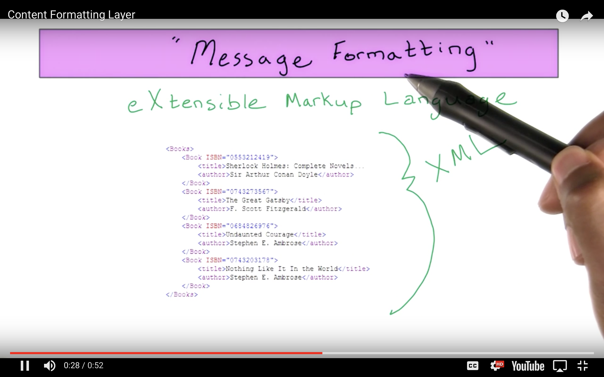

# Content Formatting Layer

So we've covered ways to communicate between machines, but how do we format the sets of information that we want to send and receive? The **Message Formatting** layer contains the languages that address this concern.

These protocols focus mainly on the data structures that contain the information we want to communicate.

Like the protocols in the other layers, there are several implementations already out there, but the most two common formats are XML and JSON.

**XML** stands for the **eXtensible Markup Language**. It looks very similar to HTML and is readable by humans and machines.

**JSON** stands for **JavaScript Object Notation**. It was designed to resemble JavaScript code, and has `attribute:value` pairs, making it also very easy to read from the human eye.

With all these technologies out there, we've got to do some side-by-side comparisons in order to make the choice that best suits our web application.
