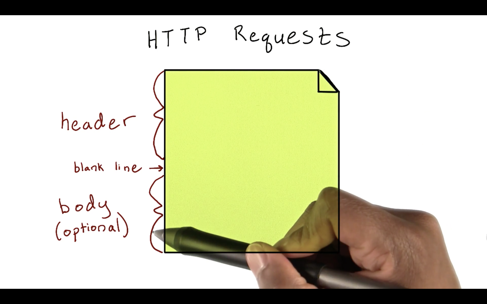
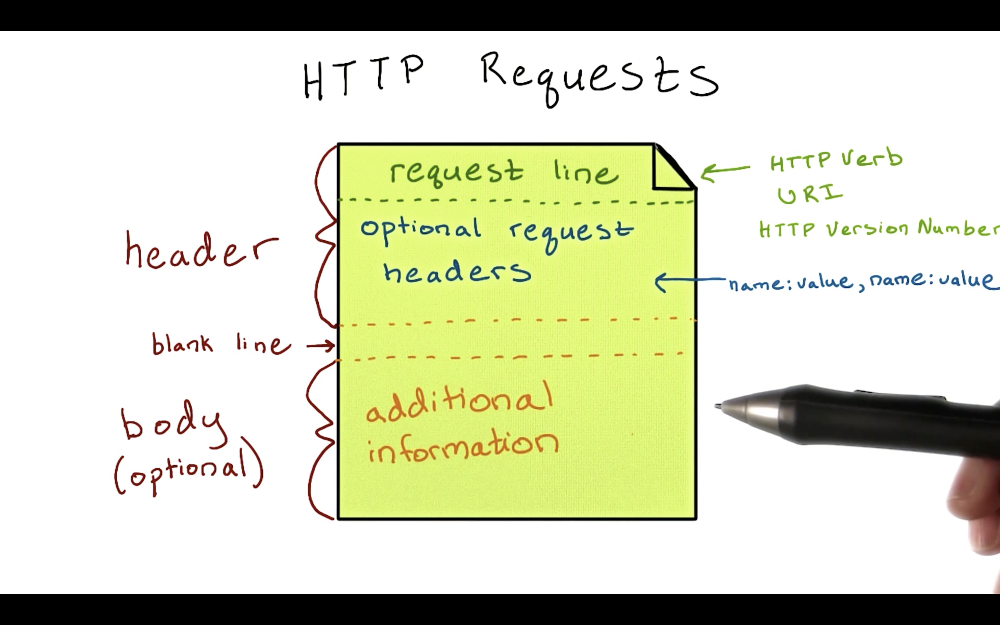
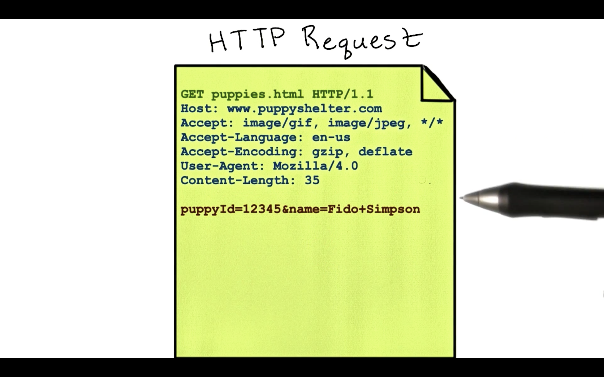

# Parts of an HTTP Request

A fundamental part of understanding restful APIs is understanding the components that make up the client-server flow of HTTP.

**HTTP** can be described as a **pull protocol**: communication is always initiated by the client sending an HTTP request to the server. In turn, the server responds with a response message. These messages are just bodies of text that the machines can later interpret into actions, images, and even multimedia content.

Let's briefly discuss some of the major components of HTTP requests and responses starting with requests.



Every HTTP message consists of a message **header**, and an optional message **body**. These two entities are separated by a space, like in the diagram above.

In an HTTP request, the first line of the header is called the **request line**. The request line contains the HTTP verb, the URI (or Uniform Resource Identifier), and the HTTP version number. Take a look at these examples of request lines:

```
GET /home.html HTTP/1.1
```
```
POST /index.html HTTP/1.1
```
```
DELETE /query.html HTTP/1.1
```

We see the verb first, the resource we want to access via the URI next, and the version of HTTP we are using at the end.

After the request line, we have the **optional request headers**. These are parameters that can be used to describe specific properties about a request. Request headers appear in `name:value` pairs. Multiple values can be separated by commas, like so:
```
name: value, name: value
```
A blank line separates the header and body of an HTTP request. In the body we can add any other information about the request that we want to send along to the server.



An example of a complete HTTP request message is shown below:


