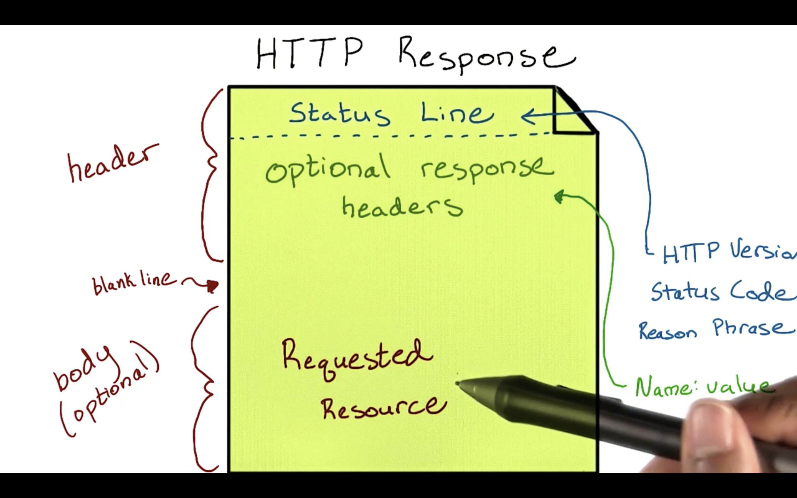
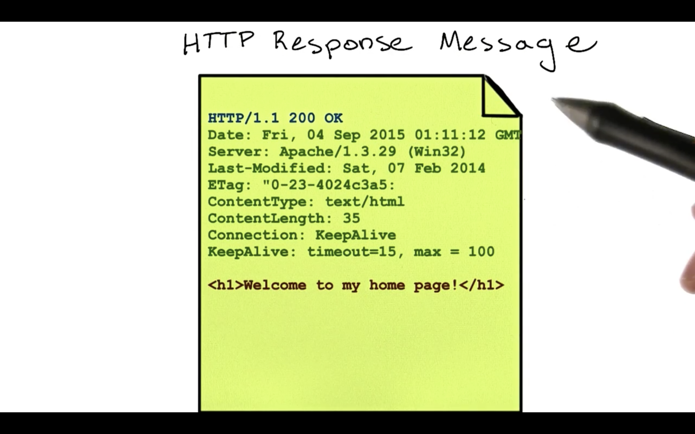

# HTTP Response

When a server receives an HTTP request, it returns a response message to the client. This response can contain the information requested or an error message if there was one.

Similarly to the HTTP request message, the response consists of a message header and optional body. The first line of the header is called the **status line**, followed by optional response headers. The status line contains the HTTP version, status code, and a reason phrase that explains the status code in English. Here are some common status codes and reason phrases:
```
"200 OK"
```
```
"404 Not Found"
```
```
"403 Forbidden"
```
```
"500 Internal Server Error"
```
The optional response headers take the form of `name:value` pairs, similarly to their request header counterparts.

The response message body contains the data that the client requested.



If the client asked for a web page, a sample response might look something like this:



When you search the web, your web browser takes care of creating HTTP requests and rendering responses onto your screen. But as an API developer, there will be times when you have to create and dissect these messages yourself. You'll learn some ways to do this in the next part.
