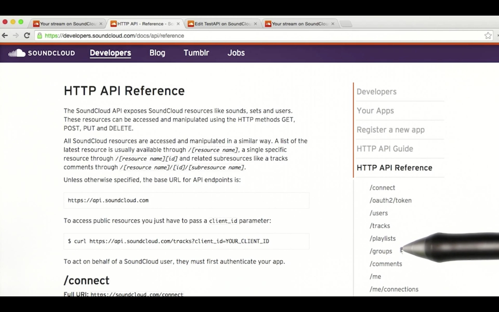
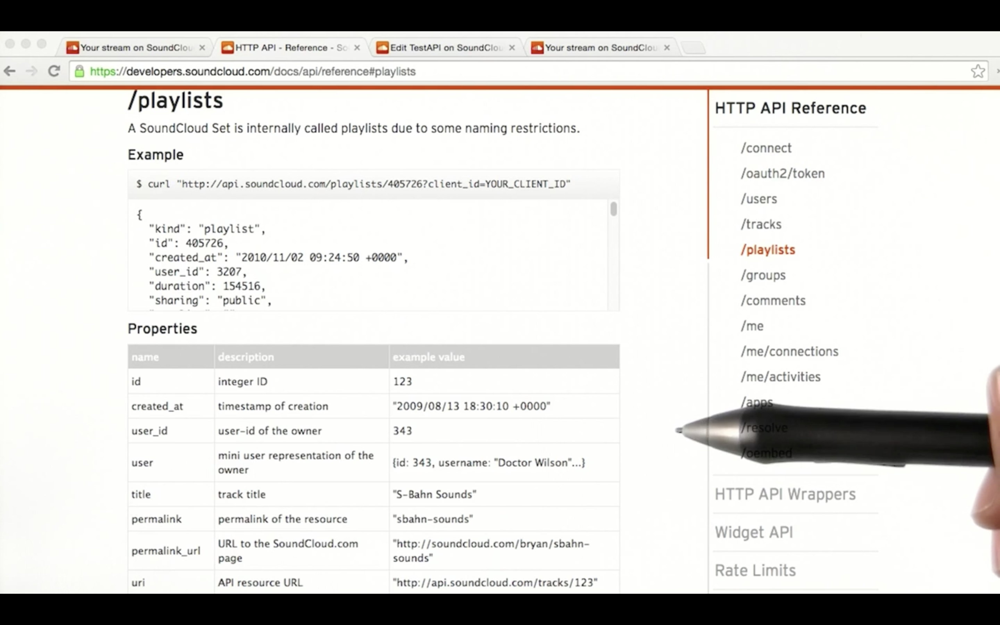
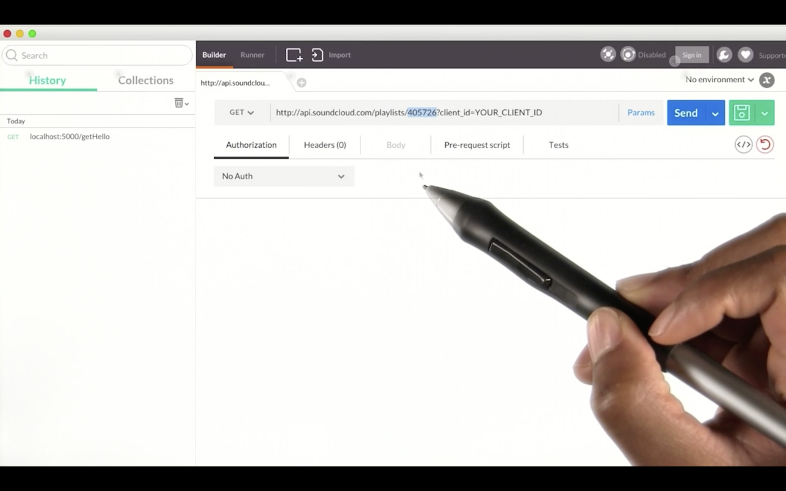

# Searching for API Documentation

So now that you've sent requests to a `localhost` server, let's try seeing if we can get information from other servers out on the Internet. Let's say I want to try to access the API for SoundCloud, an online audio distribution platform that enables its users to upload, record, promote and share their originally created sounds.

In order to figure out what requests I can send to the SoundCloud server I will go to their **[developer website](https://developers.soundcloud.com)** and search through the documentation.

To control and protect their resources, SoundCloud requires developers to register each application they want to create that will communicate with their API. Once my account is created, I'm privided a Client ID and Client Secret. I can embed these credentials into my request in order to successfully access the SoundCloud API.

> ### Errata:
> As of December 2017, SoundCloud is no longer accepting new API sign-ups 🙄

Now, searching through the documentation, I see the resources that are available for me to access, along with some examples on how to create requests to access this information.

Many of the `POST`, `PUT` and `DELETE` methods are protected with access tokens, since my app would need permission from end users in order to post information to SoundCloud on their behalf.

So for now, I'm just going to build a get request to view the contents of a playlist with the following playlist ID:

I must also add my `client_id` so SoundCloud could recognize that it's my application trying to communicate with the server. I can build the request using cURL or Postman, send it off, and see that I received a successful response. If I open the permalink URL provided in the response, I can also see the HTML page that contains this playlist information in my browser.

Next, you're going to delve into some APIs on your own.
