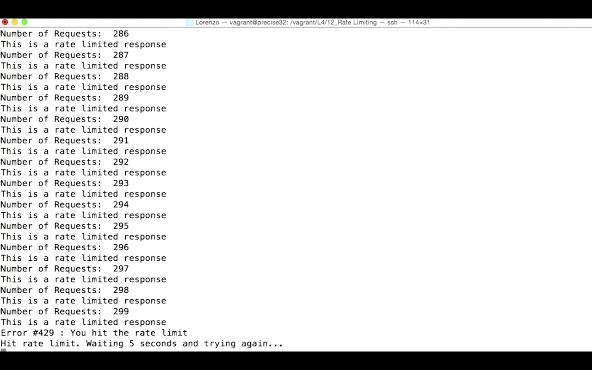

# Rate limiting

So with tokens and OAuth we can now control authentication and authorization for our API endpoints. But what happens when users are using the endpoint too much? If we have one data hog constantly pinging the API, our other users might experience drops in performance or may not be able to access our API at all. Or maybe our API isn't available for free and users should be paying for a certain amount of access over a period of time.

With **rate limiting**, we can give our server a bit more control over the amount of requests we will request from a user over a certain time period.

Next, we will make a rate limited endpoint in a Flask web application. This exercise uses some more advanced topics in Python.

----

## exercise

I will create a new *views.py* file with a route called `/rate-limited`. Later, I will create a limiting decorator to restrict the number of requests. I should point out that for this example, I'm using the IP address as the identifier of the client. This way, rate limiting works even for non-logged users, but you can change this for your implementation of future projects.

```Python
from flask import Flask, jsonify, g, request


app = Flask(__name__)

@app.route('/rate-limited')
def index():
    return jsonify({'response':'This is a rate limited response'})

if __name__ == '__main__':
    app.debug = True
    app.run(host = '0.0.0.0', port = 5000)
```

**Redis** is an open source in-memory data structure that can be used as a database, cache and message broker. Redis provides us with a fast way to keep track of endpoint requests that is also scalable.

Your vagrant machine already has Redis installed. Just run Redis server from inside your vagrant machine to fire up this Redis instance.

```powershell
vagrant@vagrant:~$ redis-server
```

You can now point to your Redis instance with the code here:

```python
import time
from functools import update_wrapper
from flask import Flask, jsonify, g, request
from redis import Redis


redis = Redis()
app = Flask(__name__)

@app.route('/rate-limited')
def index():
    return jsonify({'response':'This is a rate limited response'})

if __name__ == '__main__':
    app.debug = True
    app.run(host = '0.0.0.0', port = 5000)
```

Now, I will make a class called RateLimit that takes in the new object model, introduced in Python 2.2. I will make a variable called `expiration_window` that will give my key an extra 10 seconds to expire in redis, so that badly synchronized clocks between workers and the redis server do not cause any problems.
```python
class RateLimit(object):
    expiration_window = 10

    def __init__(self, key_prefix, limit, per, send_x_headers):
        self.reset = (int(time.time()) // per) * per + per
        self.key = key_prefix + str(self.reset)
        self.limit = limit
        self.per = per
        self.send_x_headers = send_x_headers
        p = redis.pipeline()
        p.incr(self.key)
        p.expireat(self.key, self.reset + self.expiration_window)
        self.current = min(p.execute()[0], limit)

    remaining = property(lambda x: x.limit - x.current)
    over_limit = property(lambda x: x.current >= x.limit)
```
* I then create an `__init__` method for the `RateLimit` class, taking in itself, the variables `key_prefix`, `limit`, `per` and `send_x_headers`.
* `key` is going to represent a string that I will use to keep track of the rate limits for each of the requests.
* `limit` and `per` define the number of requests we want to allow over a certain time period.
* `send_x_headers` is a Boolean option that will allow us to inject into each response header the number of remaining requests a client can make before they hit the limit.
* I defined `reset` here to make a timestamp to indicate when a request limit can reset itself. Then I append this to my key.
* We use a `pipeline` to make sure that we never increment a key without also setting the key expiration in case an exception happens between those lines. For instance, if a process is killed.
* We then increment the value of our `pipeline` and set it to expire based on our `reset` value and `expiration_window`.
* We add two lambda functions to calculate how many remaining requests we have left and another one that returns true if we've hit our rate limit.

We'll define the `get_view_rate_limit` which will retrieve the `_view_rate_limit` from the `g` object in Flask. We will use this function later on inside of our decorator. We'll also make a function called `on_over_limit` that returns the message that a client has reached their limit of requests along with a 429 error, which means too many requests.
```python
def get_view_rate_limit():
    return getattr(g, '_view_rate_limit', None)

def on_over_limit(limit):
    return (jsonify({'data':'You hit the rate limit','error':'429'}),429)
```

Now I will create a rate limit method that will wrap around my decorator:
```Python
def ratelimit(limit, per=300, send_x_headers=True,
              over_limit=on_over_limit,
              scope_func=lambda: request.remote_addr,
              key_func=lambda: request.endpoint):
    def decorator(f):
        def rate_limited(*args, **kwargs):
            key = 'rate-limit/%s/%s/' % (key_func(), scope_func())
            rlimit = RateLimit(key, limit, per, send_x_headers)
            g._view_rate_limit = rlimit
            if over_limit is not None and rlimit.over_limit:
                return over_limit(rlimit)
            return f(*args, **kwargs)
        return update_wrapper(rate_limited, f)
    return decorator
```
The `key` is constructed by default from the remote address and the current endpoint. Before the function is executed, it increments the rate limit with the help of the `RateLimit` class and stores an instance on the `g` object as `g._view_rate_limit`. If the view function is indeed over the limit, we automatically call a different function instead.

Now, I will append the number of remaining requests, the limit for that endpoint, and the time until the limit resets itself inside the header of each response that hits the rate limited request.
```python
@app.after_request
def inject_x_rate_headers(response):
    limit = get_view_rate_limit()
    if limit and limit.send_x_headers:
        h = response.headers
        h.add('X-RateLimit-Remaining', str(limit.remaining))
        h.add('X-RateLimit-Limit', str(limit.limit))
        h.add('X-RateLimit-Reset', str(limit.reset))
    return response
```
* This feature can be turned off if `send_x_headers` is set to false whenever the `ratelimit` decorator is called.

Speaking of `ratelimit` decorator, I can now add the rate limit to my route. Here it's currently set to allow 300 requests per 30 seconds:
```Python
@app.route('/rate-limited')
@ratelimit(limit=300, per=30 * 1)
def index():
    return jsonify({'response':'This is a rate limited response'})
```

So if everything worked well, I can fire up my flask web app and run this *hungryclient.py* file I made in order to see how well my rate limiter works.

I'll tell `hungryclient` to send off 2000 requests per minute or as fast as it can:

```powershell
vagrant@vagrant:~$ python hungryclient.py
Please enter the uri you want to access,
 If left blank the connection will be set to 'http://localhost:5000/rate-limited':
Please specify the number of requests per minute:   2000
```


As you can see, `hungryclient` is successfully reaching the endpoint until it hits the limit, then it waits 5 seconds and tries again. Once the time limit is reached and reset, more requests can be made until we reach 2000.

----

View the code from this exercise **[here](https://github.com/udacity/APIs/tree/master/Lesson_4/12_Rate%20Limiting)**.
